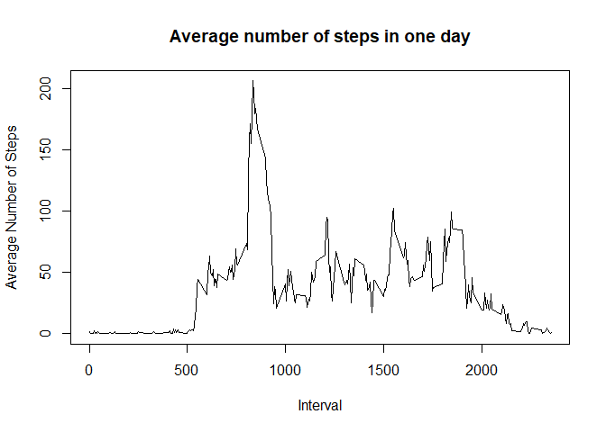

## Loading and preprocessing the data

Here we first unzip and load the csv file into R. Then, we convert the date and interval into one single datetime variable for processing. This is achieved by first padding zeros to the interval, then concatenating it with the date, and parsed with ymd_hm function from lubridate library. Finally, we form the processed dataframe by taking the datetime formatted and steps variable.


```r
library(lubridate)
```

```
## 
## Attaching package: 'lubridate'
```

```
## The following objects are masked from 'package:base':
## 
##     date, intersect, setdiff, union
```

```r
library(stringr)
library(dplyr)
```

```
## 
## Attaching package: 'dplyr'
```

```
## The following objects are masked from 'package:stats':
## 
##     filter, lag
```

```
## The following objects are masked from 'package:base':
## 
##     intersect, setdiff, setequal, union
```

```r
library(ggplot2)
Sys.setenv("LANGUAGE"="En")
Sys.setlocale("LC_ALL", "English")
```

```
## [1] "LC_COLLATE=English_United States.1252;LC_CTYPE=English_United States.1252;LC_MONETARY=English_United States.1252;LC_NUMERIC=C;LC_TIME=English_United States.1252"
```

```r
unzip("activity.zip")
act <- read.csv("activity.csv")
act_df <- data.frame(datetime=ymd_hm(paste(act$date, str_pad(act$interval, 4, side="left", pad="0"))), steps=act$steps)
```

## What is mean total number of steps taken per day?

Here, we calculate the total number of steps per day by grouping the date in our datetime variable. Below we show the distribution by plotting the histogram. Then we calculate the mean and median of the number of steps per day.


```r
steps_by_day <- with(act_df, aggregate(steps, by=list(date(datetime)), FUN=sum, na.rm=TRUE))
hist(steps_by_day$x, breaks=20, main="Daily number of steps", xlab="Number of steps", ylab="Frequency")
```

<!-- -->

```r
mean(steps_by_day$x)
```

```
## [1] 9354.23
```

```r
median(steps_by_day$x)
```

```
## [1] 10395
```

## What is the average daily activity pattern?

Next, we compute the average number of steps over each 5 mins interval and plot the resulting time series. The interval at which the maximum average number of steps is recorded is also calculated.


```r
steps_by_interval <- tapply(act_df$steps, as.integer(strftime(act_df$datetime, format="%H%M")), FUN=mean, na.rm=TRUE)
plot(steps_by_interval, type="l", xaxt="n", xlab="Interval", ylab="Average Number of Steps", main="Average number of steps in one day")
xnames <- names(steps_by_interval)
axis(1, at=60*(1:4)+1, xnames[60*(1:4)+1])
```

<!-- -->

```r
which(steps_by_interval==max(steps_by_interval))
```

```
## 1635 
##  200
```

## Imputing missing values

Notice that the original data contains a number of NAs in the steps information. The number of such data is shown below. To impute the missing data, we calculate the number of steps measured during the same hour in the same day of the missing data. After imputing the data, we then plotted the histogram and calculated the mean and median of the new data set. Notice that they are the same as the original data. This is confirmed by looking at the NAs of the original data set, in which whenever there was NA value, it has occured over the entire day (and therefore averaging out steps over the same day/hour gives 0).


```r
sum(is.na(act_df$steps))
```

```
## [1] 2304
```

```r
steps_by_hour <- tapply(act_df$steps, strftime(act_df$datetime, format="%Y-%m-%d %H"), FUN=sum, na.rm=TRUE)
act_df_imputed <- mutate(act_df, steps=ifelse(is.na(steps), steps_by_hour[strftime(datetime, "%Y-%m-%d %H")], steps))
steps_by_day <- with(act_df_imputed, aggregate(steps, by=list(date(datetime)), FUN=sum, na.rm=TRUE))
hist(steps_by_day$x, breaks=20, main="Daily number of steps", xlab="Number of steps", ylab="Frequency")
```

<!-- -->

```r
mean(steps_by_day$x)
```

```
## [1] 9354.23
```

```r
median(steps_by_day$x)
```

```
## [1] 10395
```

## Are there differences in activity patterns between weekdays and weekends?

Finally, we compare the activity patterns between weekdays and weekends by comparing them on 2 panels of a plot. 


```r
wday <- as.factor(ifelse(grepl("S(at|un)", weekdays(act_df_imputed$datetime, abbr=TRUE)), "weekend", "weekday"))

act_df_imputed_wday <- cbind(act_df_imputed, wday=wday)
act_df_imputed_wday <- cbind(act_df_imputed_wday, time=as.integer(strftime(act_df_imputed_wday$datetime, format="%H%M")))

mean_steps_by_wday_time <- with(act_df_imputed_wday, aggregate(steps, by=list(wday, time), FUN=mean))
colnames(mean_steps_by_wday_time) <- c('wday', 'time', 'meanSteps')
ggplot(mean_steps_by_wday_time, aes(time, meanSteps)) + geom_line() + facet_wrap(.~wday, dir="v") + labs(title = "Average number of steps on weekdays/weekends", x="Interval", y="Mean number of steps")
```

<!-- -->

  
